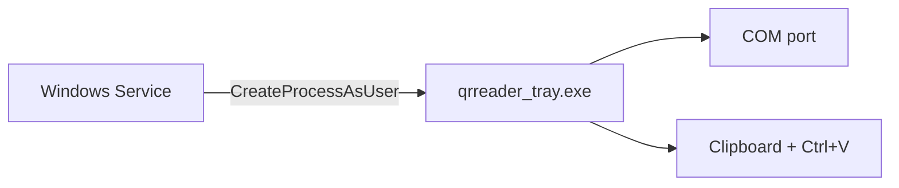

# qrreader Windows C++ (Windows 7 and later)

Native Windows rewrite of `qrreader.pyw` — no Python required.

## Components

| Program | Role |
|---------|------|
| **`qrreader_tray.exe`** | System tray icon, serial read, clipboard, paste (runs in **your logged-in desktop**) |
| **`qrreader_service.exe`** | Windows Service: starts tray at logon, restarts tray if it exits |
| **`qrreader_windows.exe`** | Console version (debugging, same logic as tray) |

**Important:** Clipboard and `Ctrl+V` only work in the **user session**. The service does not paste by itself; it launches `qrreader_tray.exe` in the active user session (correct pattern on Windows 7+).

## Requirements

- Windows 7 or later
- CMake + MinGW-w64 **or** Visual Studio C++ tools
- QR scanner on a COM port (default `COM21`)

## Build (MinGW)

```powershell
$env:Path = "C:\Users\nemanja.grgic\mingw64\bin;C:\Program Files\CMake\bin;" + $env:Path
cmake -S . -B build-mingw -G "MinGW Makefiles"
cmake --build build-mingw
```

Outputs (copy all three `.exe` files to the same folder for deployment):

- `build-mingw\qrreader_tray.exe`
- `build-mingw\qrreader_service.exe`
- `build-mingw\qrreader_windows.exe`

## Build (Visual Studio)

```bat
cmake -S . -B build-windows -A x64
cmake --build build-windows --config Release
```

Files under `build-windows\Release\`.

## Install as service + tray (admin)

1. Copy **`qrreader_tray.exe`** and **`qrreader_service.exe`** to the same directory (e.g. `C:\Program Files\QRReader\`).

2. Open **Command Prompt as Administrator**:

```bat
cd C:\Program Files\QRReader
qrreader_service.exe --install
```

This registers **QR Reader Service** (auto-start) and starts it. The service launches the tray app in the logged-on user session.

3. Tray icon appears near the clock. Right-click:
   - **Open log file**
   - **Open config folder**
   - **Reset serial connection** — close COM port and reopen (use after unplugging the scanner)
   - **Auto-reconnect: ON/OFF** — when ON, reconnects automatically after disconnect; when OFF, waits until you choose **Reset serial connection**
   - **Exit**

## Run tray only (no service)

```bat
qrreader_tray.exe
```

Or start from service helper:

```bat
qrreader_service.exe --start-tray
```

## Uninstall service

Administrator command prompt:

```bat
qrreader_service.exe --uninstall
```

## Configuration

| File | Purpose |
|------|---------|
| `%LOCALAPPDATA%\QRReader\port.txt` | COM port, one line (e.g. `COM21`) |
| `%LOCALAPPDATA%\QRReader\auto_reconnect.txt` | `1` = auto-reconnect after disconnect (default), `0` = manual reset only |
| `%LOCALAPPDATA%\QRReader\qrreader.log` | Debug log (timestamps, clipboard/paste, serial connect/disconnect) |

Edit `port.txt` while tray is stopped, or edit then restart tray.

## Console debug build

```bat
qrreader_windows.exe COM21
```

Logs to console and the log file.

## Behavior

Same as `qrreader.pyw` / Linux port:

- Serial `9600 8N1`, wait for >4 bytes, flush stale input on open
- Read serial before clipboard
- Cyrillic → Latin, line breaks → `#`
- Wait until clipboard matches scan text before `Ctrl+V`
- Restore previous clipboard after paste

## Architecture (why two programs)



Services run in Session 0 and cannot reliably drive the user’s clipboard or focused window. The tray app runs in the interactive session where paste works.

## Notes

- User must be **logged in** (service starts tray after logon).
- Focus the target app before scanning.
- Double-click tray icon opens the log in Notepad.
